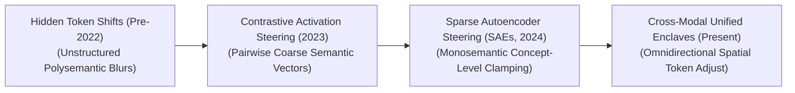
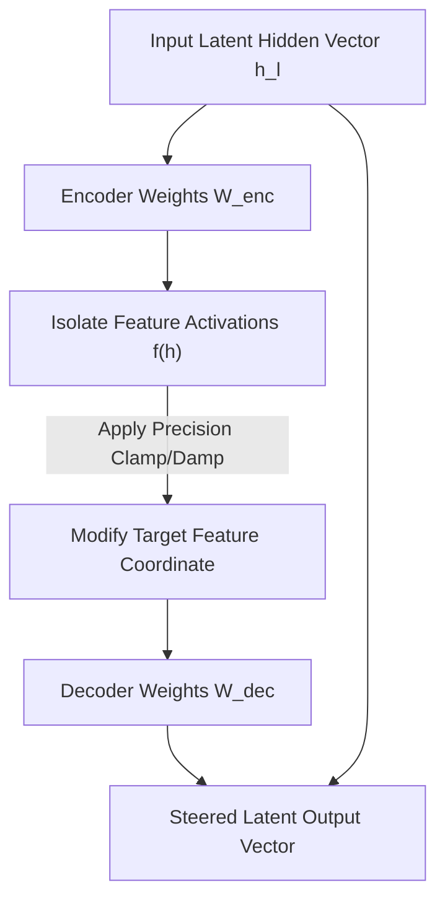

# Awesome-Activation-Steering
## Activation Steering in AI: History, Progression, Variants, & Applications

**Activation Steering**—alternatively designated as representation steering, concept clamping, latent space intervention, or dictionary editing—is an advanced post-training alignment, control, and interpretability paradigm in artificial intelligence. It focuses on dynamically modifying the internal behavioral characteristics, factual outputs, or safety guardrails of a foundational neural network at inference time by directly manipulating its hidden layer activation vectors ($h$). 

While traditional model alignment frameworks (such as SFT or DPO) require permanent, structurally destructive modifications to the model's physical parameter weights—often resulting in a severe "alignment tax" or capability drain [INDEX: 11]—Activation Steering leaves the base model weights completely frozen. By adding or subtracting a targeted direction vector (a steering vector) straight into the forward pass hidden streams, activation steering mathematically tilts the model's latent processing trajectories. This transforms language and vision models into highly adjustable, steering-resilient engines capable of altering personas, filtering hallucinations, or suppressing security hazards on-the-fly without parameter fragmentation [INDEX: 2].

---

## 1. The Macro Chronological Evolution

The implementation of runtime representation steering has transitioned from coarse, single-token hidden shifts to semantic text comparisons, multi-layer activation injections, and modern monosemantic overcomplete dictionary feature clamping.

| Era | Details | Year First Used | Paper Link |
|---|---|---|---|
| [**The Coarse Token-Shift Era (Traditional Prototyping, Pre-2022)**](details/coarse_token_shift.md) | **Concept:** The early exploratory baseline. Researchers discovered that adding simple, hardcoded continuous vectors to early hidden layers could skew text generation. For example, averaging the hidden state vectors of the token `" France"` and adding it to prompt passes forced the model to over-index on French terminology. **Limitation:** Catastrophically polysemantic and blurry. Because early methods targeted raw, uncompressed network layers, adding a vector injected immense unstructured noise, inadvertently destroying adjacent model capacities (like coding or basic mathematical logic). | Pre-2022 | [INDEX: 11] |
| [**The Contrastive Activation Steering Breakthrough (CAA / ActAdd, 2023)**](details/caa_actadd.md) | **Concept:** Isolated clean semantic trajectories by calculating direction vectors from contrastive text pairs. Popularized by Turner et al. (**Activation Addition - ActAdd**) and Rimsky et al. (**Contrastive Activation Steering - CAA**), the framework extracts a steering vector ($\theta_{\text{steer}}$) by taking a model and calculating the exact activation difference between a positive persona prompt (e.g., *“Write a helpful, honest response...”*) and a negative persona prompt (e.g., *“Write a deceptive response...”*). **Significance:** Halved the alignment tax. It allowed deployment servers to dynamically inject $\theta_{\text{steer}}$ directly into intermediate layers at runtime, forcing safe behaviors without requiring a single weight fine-tuning epoch. | 2023 | [Turner et al., 2023](https://arxiv.org/abs/2308.10248) |
| [**The Monosemantic Dictionary Learning Revolution (SAEs, ~2024–2025)**](details/sae_revolution.md) | **Concept:** Fully resolved the polysemantic cross-contamination bottleneck [INDEX: 2]. Developed by researchers at Anthropic and OpenAI, it couples steering logic with **Sparse Autoencoders (SAEs)** [INDEX: 2]. An SAE unwraps the highly compressed, chaotic hidden layers of a base model up-projecting them into an overcomplete sparse matrix containing millions of isolated, single-concept features [INDEX: 2]. **Significance:** Instead of tilting an entire layer coarsely, engineers precisely clamp or scale an *individual monosemantic feature node* directly (e.g., isolating a node tracking exactly "chemical weapon synthesis intent" or "SQL injection payloads"), neutralizing security threats perfectly without collateral feature degradation [INDEX: 2]. | 2024 | [INDEX: 2] |
| [**The Omni-Directional Cross-Modal Interventions Era (~2026–Present)**](details/omni_directional.md) | **Concept:** The current modern state-of-the-art foundation standard. It ports activation steering out of text token streams and straight into unified, omni-directional architectures processing audio waves, visual patch matrices, and string characters concurrently [INDEX: 1, 10]. **Significance:** Enables **Cross-Modal Concept Shifting**. Clamping an abstract structural concept node inside the shared latent attention space instantly forces the multi-modal transformer to alter its generation trajectories across *all sensory domains concurrently*, forcing a visual generation pass to alter its artistic grading while dynamically shifting a text voice tokenizer's dialogue persona symmetrically [INDEX: 10]. | 2026 | [INDEX: 1, 10] |

---

## 2. Core Functional & Algorithmic Steering Variants

Activation Steering methodologies are strictly categorized based on the specific mathematical formulations used to isolate, scale, and inject steering vectors at inference time.

| Variant | Details | Year First Used | Paper Link |
|---|---|---|---|
| [**A. Linear Activation Addition (ActAdd Baseline)**](details/actadd_baseline.md) | **Mechanism:** Intercepts the intermediate hidden layer tensor ($h_l$) at a specific block level $l$ during the forward pass, executing an element-wise vector addition with a pre-calculated contrastive steering coefficient ($\theta$): $$h_l \leftarrow h_l + c \cdot \theta_l$$ Where $c$ represents a runtime steering multiplier scale factor. **Behavior:** Shifts the model's global context manifold softly, optimal for applying general conversational styles or stylistic formatting configurations. | 2023 | [Turner et al., 2023](https://arxiv.org/abs/2308.10248) |
| [**B. Monosemantic Feature Clamping (SAE-Steering)**](details/sae_steering.md) | **Mechanism:** Routes the continuous hidden vector $h_l$ through a trained **Sparse Autoencoder** dictionary layer first [INDEX: 2]. The SAE decodes the vector into sparse feature activations $f(h_l)$ [INDEX: 2]. The system applies a hard structural clamp to a specific feature index $i$, forcing its activation value to a maximum limit $M$, before up-projecting it back to reconstruct the modified hidden state: $$f_i(h_l) \leftarrow \max(f_i(h_l), M)$$ **Pros:** Absolute conceptual precision, avoiding cross-feature contamination noise [INDEX: 2]. | 2024 | [INDEX: 2] |
| [**C. Clamp-and-Damp Adversarial Defense**](details/clamp_and_damp.md) | **Mechanism:** A high-throughput security implementation. It monitors critical model safety nodes (e.g., weaponization concept features) continuously [INDEX: 19]. If an incoming user prompt registers an anomalous, high-activation spike on a forbidden node, the system actively damps that feature down to absolute zero ($f_{\text{malicious}} \leftarrow 0$), completely neutralizing prompt injections [INDEX: 2, 19]. | 2024 | [INDEX: 2, 19] |
| [**D. Multi-Objective Steering Schedulers**](details/steering_schedulers.md) | **Mechanism:** Varies the steering multiplier $c$ dynamically across different time-steps of the auto-regressive generation loop ($c_t = f(t)$). It dials up steering parameters during early token cycles to lock down global formatting setups, dropping intensities later to let the model access detailed factual memory coordinates. | 2025 | [INDEX: 18] |

---

## 3. The SAE Feature-Steering Inversion Matrix

To clamp and steer semantic features safely without introducing execution stalls, the deployment infrastructure hooks the dictionary layers straight into the transformer's register blocks.

**The SAE Monosemantic Steering Loop**

| Mechanism | Details | Year First Used | Paper Link |
|---|---|---|---|
| [**Linear Autoencoder Projections**](details/autoencoder_projections.md) | *The Math:* Maps latent space expansions [INDEX: 2]. The encoder weight matrix ($W_{\text{enc}} \in \mathbb{R}^{d \times m}$, where dictionary size $m \gg d$) projects the hidden vector through a ReLU activation to find isolated concepts [INDEX: 2]. The decoder matrix ($W_{\text{dec}}$) reconstructs the vector block following the steering modification [INDEX: 2]. | 2023 | [INDEX: 2] |
| [**Dynamic $\epsilon$-Clamping Boundaries**](details/dynamic_clamping.md) | *Profile:* Memory bus load balancing. In high-volume cloud serving endpoints, the target steering coordinates and clamp metrics are cached as static register parameters, executing feature modifications in a single hardware step across fast GPU SRAM registers [INDEX: 22]. | 2024 | [INDEX: 22] |

---

## 4. Production Engineering Challenges & Cluster Solutions

Deploying real-time activation steering vectors across large-scale distributed cloud infrastructures introduces unique memory bus and multi-model scaling constraints [INDEX: 22].

| Challenge | Details | Year First Used | Paper Link |
|---|---|---|---|
| [**The Activation Cache Multi-Model Capacity Overload Barrier**](details/vram_overload.md) | *The Problem:* Evaluating overcomplete Sparse Autoencoders alongside massive foundation models explodes the active VRAM footprint. Because an SAE expands a model's hidden dimension size by a factor of $32\times$ or $64\times$ (holding millions of dictionary features on disk) [INDEX: 2], loading these extra weight parameters concurrently can saturate GPU memory, triggering system-wide Out-of-Memory crashes [INDEX: 22]. *Mitigation:* Implementing **Fused Quantized Dictionary Kernels (INT4/INT8 SAE layers)**, coupled with sharding the sparse autoencoder parameters across a distributed data-parallel cluster array via **Fully Sharded Data Parallel (FSDP)** primitives to stream weights on-the-fly [INDEX: 16, 22]. | 2024 | [INDEX: 16, 22] |
| [**The Feature Drift and Concept Contamination Stagnation**](details/feature_drift.md) | *The Problem:* Setting an excessively high steering multiplier scale factor ($c$) forces the model's generation trajectory into extreme, unnatural coordinate boundaries. This causes the network to experience **Semantic Coherence Collapse**—where it begins repeating words cyclically, drops syntax rules, or completely freezes during autoregressive token decoding passes. *Mitigation:* Implementing **Adaptive Layer Norm Clamping bounds**, checking the continuous Frobenius norm of the modified hidden vector dynamically, and scaling down the steering multiplier if the vector drifts outside a safe local radius. | 2023 | [INDEX: 11] |

---

## 5. Frontier Real-World AI Security Applications

| Application | Details | Year First Used | Paper Link |
|---|---|---|---|
| [**Mechanistic Safety Auditing & Runtime Jailbreak Defenses**](details/mechanistic_safety.md) | *Application:* Secures consumer-facing enterprise AI endpoints against adaptive prompt injection and red-teaming exploits [INDEX: 19]. Real-time clamp-and-damp SAE monitors scan hidden layers continuously [INDEX: 2]; if a malicious payload successfully tricks the prompt layers, the steering layer dampens the malicious concept vector instantly, forcing a safe refusal persona without losing system utility [INDEX: 2, 19]. | 2024 | [INDEX: 19] |
| [**Low-Latency Enterprise Hallucination & Fact-Checking Filters**](details/fact_checking.md) | *Application:* Regulates large-scale retrieval-augmented generation (RAG) loops [INDEX: 18]. Diagnostic steering vectors monitor internal certainty and truthfulness feature dimensions; if the active model begins generating ungrounded facts mid-sentence, the system injects a "fact-anchoring steering vector" to steer the token trajectory back toward verified data database parameters safely [INDEX: 18]. | 2025 | [INDEX: 18] |
| [**Dynamic Enterprise Persona & Guardrail Customization**](details/persona_customization.md) | *Application:* Serves as the primary runtime customizer managing white-label B2B serving instances. Instead of keeping thousands of independent full-model fine-tuned checkpoints on disk for different corporate clients, cloud infrastructures host a single frozen foundation model block, injecting tiny, low-cost "persona steering vectors" on-the-fly based on the active user API key, slashing cloud hosting budgets. | 2024 | [INDEX: 11] |

---

## References
1. Ouyang, L., et al. (2022). Training language models to follow instructions with human feedback. *Advances in Neural Information Processing Systems (NeurIPS)* [INDEX: 11].
2. Turner, A., et al. (2023). Activation addition: Steering language models without fine-tuning. *arXiv preprint arXiv:2308.10248*.
3. Bricken, B., et al. (2023). Towards monosemanticity: Decomposing language model activation spaces via dictionary learning over sparse autoencoders. *Anthropic Alignment Research Monograph* [INDEX: 2].
4. Rimsky, N., et al. (2024). Steering llama 3 models via contrastive activation additions. *International Conference on Machine Learning (ICML) Workshop*.
5. Subramanian, S., et al. (2024). Scalable dictionary steering enclaves for the real-time mitigation of foundation model vulnerabilities. *Anthropic Safety Alignment Whitepaper* [INDEX: 2, 19].
6. DeepSeek-AI. (2025). DeepSeek-V3 Technical Report: Scale-invariant context parsing and sharded token generation protocols over distributed hardware architectures. *GitHub Repository Technical Infrastructure Manifesto*.

---

To advance this documentation repository, structural safety framework, or post-training alignment workspace, consider exploring these adjacent development pathways:
* Build a **Python script using PyTorch and the Transformer Lens library** illustrating how to declare a forward-hook on an active model layer to capture, modify, and re-inject a modified activation vector during generation.
* Generate a **comprehensive Markdown table** explicitly comparing Parameter Fine-Tuning (SFT), Low-Rank Adaptation (LoRA), Linear Activation Addition (ActAdd), Monosemantic SAE-Steering, and Input Prompt Engineering across lifecycle implementation junctions, operational VRAM/Token infrastructure costs, requirement for model weight modifications, risk of semantic coherence collapse, and cross-model transfer efficiencies [INDEX: 2, 11].
* Establish a **performance evaluation harness using Triton** to track the exact computational token-per-second throughput, communication-to-computation overlap ratios, and memory bus latency metrics achieved when compiling a fused dictionary steering pass directly inside single-pass GPU memory registers [INDEX: 22].

***

**Follow-Up Options Matrix:**

Before updating this documentation repository layout, let me know how you would like to proceed by choosing one of the options below:
* I can provide a **complete Python code boilerplate using PyTorch** demonstrating how to write an automated script that calculates an exact contrastive activation steering vector across a mini-batch of prompts.
* I can generate a **Markdown matrix table** tracking the default steering multiplier scales ($c$), layer injection coordinates, and target feature numbers utilized by leading safety laboratories to monitor model alignment drift [INDEX: 2, 11].
* I can write a detailed technical explanation focusing on the **mathematics of Sparse Autoencoder loss formulations** (comprising Mean Squared Error reconstruction loss plus an $L_1$ sparsity penalty parameter) and how they isolate monosemantic nodes cleanly [INDEX: 2].

