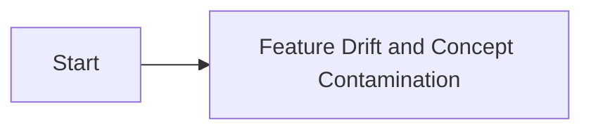

# Feature Drift and Concept Contamination

Detailed explanation of Feature Drift and Concept Contamination.

```mermaid
flowchart LR
    A[Start] --> B["Feature Drift and Concept Contamination"]
```

[Back to README](../README.md)
