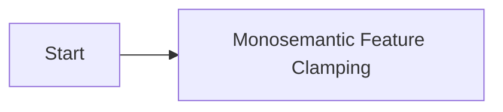

# Monosemantic Feature Clamping

Detailed explanation of Monosemantic Feature Clamping.

```mermaid
flowchart LR
    A[Start] --> B["Monosemantic Feature Clamping"]
```

[Back to README](../README.md)
